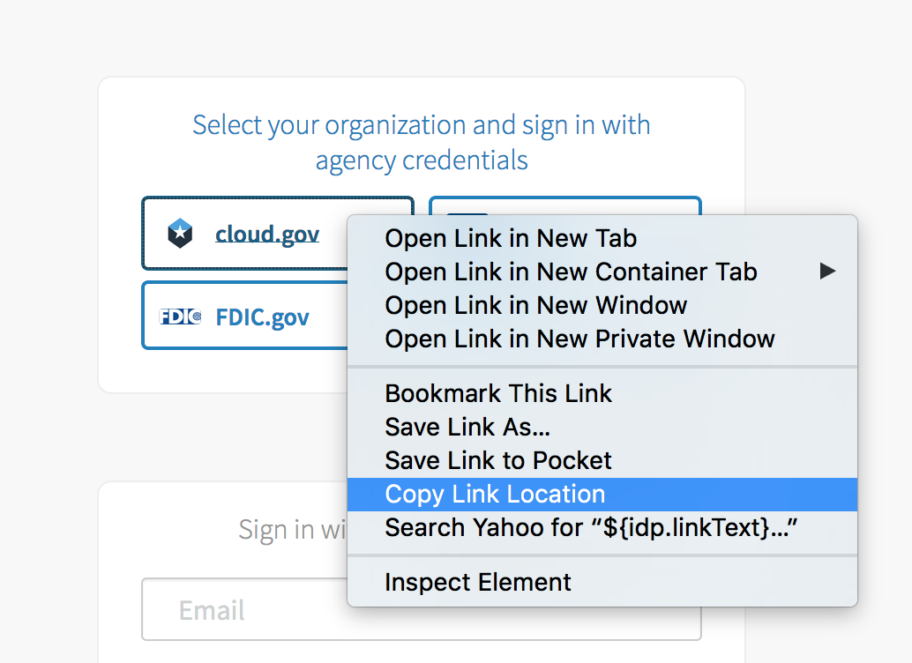

# UAA Extras [](https://codeclimate.com/github/18F/cg-uaa-extras)

This application recreates the invite functionality that previously existed in UAA by using the /invite_users API endpoint.

### Installing the App

#### Step One: Determine the URL for your instance of UAA Extras

You'll need to know where the app is going to be hosted, so you can tell UAA about it in the next step.

For example, if you'll be deploying into Cloudfoundry on BOSH-lite your url would probably be http://invite.bosh-lite.com/

#### Step Two: Create a client in UAA for this app

This application uses oauth to perform actions on your behalf in UAA.  To add a new oauth client in UAA, run the following command:

	uaac client add uaa_extras_app --name "UAA Extras" --scope "scim.invite,password.write" --authorized_grant_types "client_credentials,authorization_code" --authorities "scim.read,uaa.admin,password.write" --redirect_uri [url-from-step-one]/oauth/login -s [your-client-secret]

Remember the client-secret, you'll need it in step four.

If you are doing this within an already existing cloudfoundry deployment, you might want to create the user by editing your cf deployment with an opsfile like https://github.com/18F/cg-deploy-cf/blob/master/bosh/opsfiles/clients.yml

#### Step Three: Create redis service instance

Either create a locally running version of Redis, or create a service instance in Cloud Foundry if the app will be deployed there.

EX:

	cf create-service redis32 standard-ha redis-accounts

#### Step Four: Configure the app

The configuration is entirely read from environment variables. Edit the manifest.yml files and update your settings as neccessary. Download a copy of https://raw.githubusercontent.com/GSA/data/master/dotgov-domains/current-federal.csv and place into `uaaextras/static`

#### Step Five: Launch the app

##### Running in Cloud Foundry
This app was designed to deploy in Cloud Foundry:

	cf push

##### Local Development

This project uses a `setup.py` to install dependencies. Run the following
command to get started with development.

```shell
python3 ./setup.py install
```

To get a local server up, run the following command. Make sure you
properly setup the environment variables mentioned above in the
documentation.

```shell
./debug.py
```

### Configuring UAA Invites to leverage cloud.gov IdP

Because of the redirect that occurs for setting up cloud.gov multi-factor
authentication, the `IDP_PROVIDER_URL` must match what is coming from the UAA
login screen under `cloud.gov`.



#### A bit on the `/first-login` route

The `/first-login` route is used to redirect users with an origin of `cloud.gov`
to the cloud.gov IdP provider. This route is used to set the user's origin to
`cloud.gov` and the `externalId` to their `userName`. On a successful update of
the user, `cg-uaa-extras` will redirect to the `IDP_PROVIDER_URL` to complete
the user's authentication and TOTP token creation. This is why the URL from the
screenshot above is necessary for the `IDP_PROVIDER_URL`.

#### Running tests

Tests are run using `tox` and `flake8`.

```shell
pip install tox
```

To run the tests, simply run `tox` from the root of the repository.

### Deployment

This repository leverages [Concourse](https://concourse-ci.org). The configuration
files all reside in the `ci/` directory. All pull requests should have `staging`
as a base branch which will automatically trigger a deployment for the staging
job. Once development is stable on `staging`, create a new pull request
promoting all the changes on `staging` to `master` to deploy the application in
the production environment.
